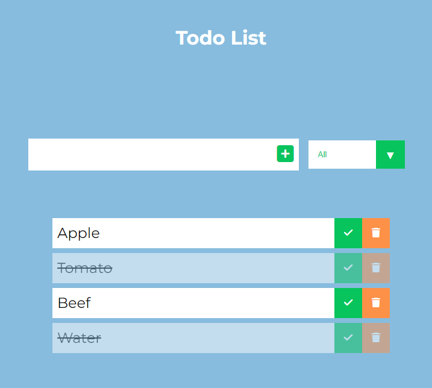

# Todo-List-JS
## Réalisation d'une Todo List pour m'entrainer à maîtriser Javascript
 
• Lire une liste de tâches, ajouter des tâches avec la souris ou le clavier.  
• Valider une tâche éffectuer, supprimer une tâche.  
• Visualiser un sous-ensemble spécifique de toutes les tâches validé, en
attente ou terminées 
• Filtre pour visualiser les tâches terminées ou non terminées.  
 

